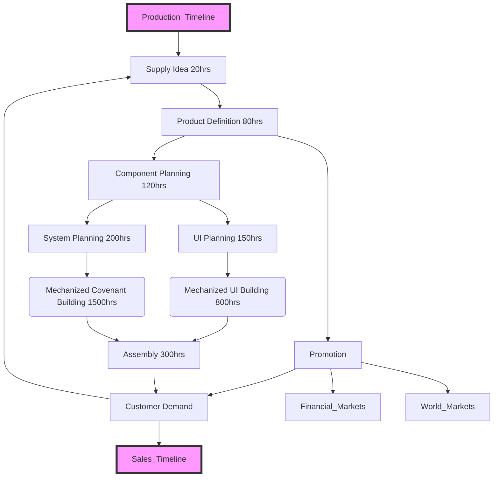

```mermaid

graph TB
Production_Timeline --> Idea
Idea --> Product_Definition[Product Definition 80hrs]
Promotion --> Customers
Promotion --> Financial_Markets
Promotion --> World_Markets
Product_Definition --> Component_planning[Component Planning 120hrs]
Product_Definition --> Promotion
Component_planning --> UI_planning[UI Planning 150hrs]
Component_planning --> System_planning[System Planning 200hrs]
System_planning --> CaaS(Mechanized Covenant Building 1500hrs)
UI_planning --> UaaS(Mechanized UI Building 800hrs)
UaaS --> Assembly[Assembly 300hrs]
CaaS --> Assembly
Assembly --> Customers
Customers[Customer Demand] --> Idea[Supply Idea 20hrs]
Customers --> Sales_Timeline

style Production_Timeline fill:#f9f,stroke:#333,stroke-width:4px
style Sales_Timeline fill:#f9f,stroke:#333,stroke-width:4px
```